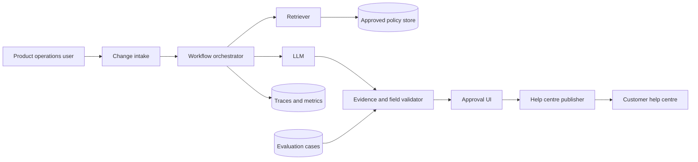
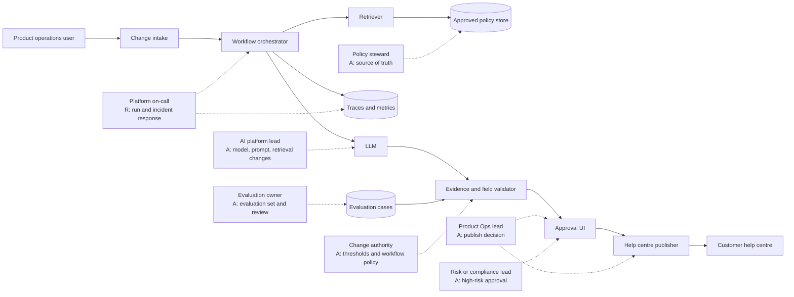

When I teach product managers to move from writing specifications to building and shipping, I keep seeing the same gap: the team can describe the system, but not what “done” means for the people around it. The boxes look complete. The operating model is still a blank space.

## The failure is not missing boxes. It is missing decision rights.

AI architecture diagrams hide the human operating model when they stop at software structure. A C4 system context diagram is meant to show a system, its users, and connected systems at a useful zoomed-out level. C4 then provides container and component views for moving into more detail. That is valuable architecture communication, but it does not claim to assign a person to every decision. [C4’s system context guidance](https://c4model.com/diagrams/system-context) and [introduction](https://c4model.com/introduction) make that scope clear.

The missing layer appears when someone asks four ordinary questions:

| Question | What a component diagram usually gives you | What an operating-model overlay must add |
| --- | --- | --- |
| Who decides? | A service, user, or workflow step | An accountable role and the decision boundary |
| Who approves? | An approval UI or gate | The approver, threshold, and exception path |
| Who operates? | A runtime, queue, or monitoring box | A run owner, on-call path, and recovery action |
| What happens when the model is wrong? | A validator, log, or fallback component | A stop rule, escalation, source recheck, rollback owner, and evaluation duty |

The test below is deliberately small. It does not show that every diagram fails. It shows how one conventional diagram can be technically legible and operationally incomplete.

## Artifact A: the conventional architecture view

The reference workflow is an AI policy-change assistant. A product-operations user submits a proposed policy change. The workflow retrieves the current approved policy, drafts an internal change brief and customer-facing notice, validates required fields and evidence links, waits for human approval, publishes the approved notice to a help centre, and records traces and corrections.

This is an explicitly bounded reference workflow, not a client system. It has no autonomous customer communication and makes no payment, account, or legal decision.

The conventional C4-style view is useful because it shows the system boundary and information flow:

This diagram answers “what exists?” and “how does the request move?” It does not answer whether the product-operations user is a submitter, a decision-maker, or both. It does not tell us whether the approval UI is a human gate or an automated status. It does not tell us who is called at 2 a.m. when publishing fails.

That is not a defect in C4. It is a scope mismatch. The diagram is being asked to carry an operating-model question it was not designed to answer.

## Artifact B: the same architecture with an operating-model overlay

The repair is not to add more technical components. Keep the same data path and add a second axis for authority, care, and change.

The overlay below names role classes because this workflow is synthetic. In a real system, replace each role class with a named person or durable team ownership. Microsoft’s role guidance makes the same practical point: “IT” is not an owner, while an accountable role is answerable for the outcome. [Microsoft’s role and decision-rights guidance](https://learn.microsoft.com/en-us/agents/center-of-excellence/roles-responsibilities) also separates central standards from domain decisions and recommends one accountable role per task.

NIST’s AI Risk Management Framework treats governance as cross-cutting and calls for clear roles, differentiated human-AI oversight, continuous lifecycle work, and assigned responsibility for superseding or deactivating systems whose outcomes are inconsistent with intended use. [NIST AI RMF Core](https://airc.nist.gov/airmf-resources/airmf/5-sec-core/) supports the reason for this overlay, but the role assignments below are the bounded artifact’s design, not a NIST-mandated org chart.

Team Topologies adds a second useful comparison. It describes stream-aligned teams as owning a flow of work end to end, while platform, enabling, and complicated-subsystem teams have different responsibilities and interaction modes. [Team Topologies’ key concepts](https://teamtopologies.com/key-concepts) helps explain why “the platform team owns the AI” is too vague. A platform team may own a service and its standards. The domain team still needs a clear owner for the business outcome.

## The decision-rights table that the baseline leaves out

Use this table beside the diagram. It is the reusable part of the artifact.

| Consequential action | Responsible | Accountable | Approval threshold | Escalation | Run/on-call | Evaluation | Knowledge steward | Change authority |
| --- | --- | --- | --- | --- | --- | --- | --- | --- |
| Admit a policy source | Product Ops maker | Policy steward | Only an identified, versioned source enters the approved store | Conflicting source to Product Ops lead, then risk/compliance | Platform on-call for ingestion failure | Evaluation owner checks source-linked cases | Policy steward | Policy steward changes acceptance rules |
| Generate a brief and draft notice | Workflow builder | Product Ops lead | Draft-only; model cannot publish | Missing evidence to Product Ops lead; system fault to AI platform lead | Platform on-call | Evaluation owner owns required-field and evidence tests | Policy steward supplies approved source | AI platform lead changes model, prompt, or retrieval; Product Ops lead changes scope |
| Approve customer-facing publication | Product Ops reviewer | Product Ops lead | Every customer-facing notice needs human approval; high-risk changes also need risk/compliance approval | Hold publication and escalate when ambiguity remains | Platform on-call supports the path | Evaluation owner reports release-gate results | Policy steward confirms source version | Product Ops lead changes business threshold; risk/compliance can raise it |
| Publish the approved notice | Publisher operator | Product Ops lead | Publish only the exact approved version with a trace ID | Version mismatch or failure to on-call and Product Ops lead; revert if needed | Platform on-call | Evaluation owner checks post-publish corrections | Policy steward owns linked source | Product Ops lead authorizes rollback; on-call executes it |
| Respond to a wrong output | On-call and Product Ops reviewer | Product Ops lead for outcome; AI platform lead for remediation | Stop publication or unpublish when evidence or scope is wrong | On-call to Product Ops lead, AI platform lead, or risk/compliance | Platform on-call | Evaluation owner turns the case into a regression test | Policy steward revalidates source | AI platform lead changes behaviour; Product Ops lead changes policy |
| Change model, prompt, retrieval, or thresholds | Workflow builder | AI platform lead for technical behaviour; Product Ops lead for task policy | Evaluation results and relevant approval required; high-risk changes need risk/compliance review | Failed evaluation to AI platform lead; policy conflict to Product Ops lead | On-call owns deployment and rollback | Evaluation owner signs off on test result | Policy steward reviews knowledge changes | AI platform lead owns technical changes; Product Ops lead owns business thresholds |

The table forces a distinction that architecture diagrams often blur:

- Responsible means doing the work.
- Accountable means answerable for the outcome.
- Approval means a release or action threshold, not a box labelled “review.”
- Run ownership means a person or team can receive an alert and act.
- Evaluation ownership means someone is responsible for learning from errors, not only measuring them before launch.
- Change authority means the person who can alter model behaviour, policy thresholds, or the knowledge source.

## The four-question failure reproduction

Reviewer B received the two artifacts and answered the same questions from each one. This was a blind second review of the frozen artifacts on 2026-08-23, not a client review and not a reliability benchmark.

| Question | Conventional view | Operating-model overlay |
| --- | --- | --- |
| Who decides? | Unanswered. The user is visible, but the decision boundary is not. | Product Ops lead decides the business publication outcome. AI platform lead decides technical behaviour changes. |
| Who approves? | Unanswered. “Approval UI” is a component, not an approver or threshold. | Product Ops reviewer approves every customer-facing notice. Risk or compliance also approves high-risk changes. |
| Who operates? | Unanswered. The runtime and traces imply software, not a human on-call path. | Platform on-call runs and monitors the workflow, supports publishing, and executes rollback. |
| What happens when the model is wrong? | Partly visible only as a component concern. The validator exists, but no stop rule, escalation, source recheck, rollback owner, or evaluation duty is shown. | Publication stops or the notice is unpublished. The case escalates, the source is revalidated, the error becomes an evaluation case, and the prior approved version can be restored. |

The result is four unanswered questions in the baseline, with a partial signal on the last one because a validator is visible. The overlay answers all four for this workflow. It does not prove that the answers are good. It proves that the artifact makes them inspectable.

## How to run the test on your own diagram

1. Pick one workflow where a model output can change a customer-facing, financial, operational, or compliance-relevant outcome.
2. Draw the context or component view without adding role labels. Keep it honest. Show systems, data stores, users, and external dependencies.
3. Ask the four questions from the baseline alone. Write “unanswered” when the diagram requires an assumption.
4. Copy the same data path into a second diagram. Add role edges for decision, approval, escalation, run, evaluation, knowledge stewardship, and change authority.
5. Add an approval threshold. “Human in the loop” is not enough. Say what the person must approve and when a second approval is required.
6. Add the wrong-output path. It should include a stop or rollback action, a person who receives the escalation, a source recheck, and a way to turn the failure into an evaluation case.
7. Give both artifacts to a reviewer who did not draw them. Ask the same four questions and preserve the assumptions.

If the overlay becomes a wall of committees, push routine decisions to the lowest level that can make them safely. Microsoft recommends that central governance own standards and guardrails while domains own prioritization, knowledge quality, day-to-day operation, and continuous improvement. Team Topologies similarly distinguishes collaboration, service consumption, and temporary facilitation instead of treating every interaction as permanent coordination.

## What this bounded test does not prove

This is one explicitly synthetic workflow and one reviewer. It does not establish how common hidden operating models are, whether the assignments fit your organization, or whether the AI workflow should be deployed.

It also does not prove that a named role has capacity or authority. “Platform on-call” can still be overloaded. “Product Ops lead” can still be unavailable. The overlay exposes those questions so the team can answer them before launch.

The main exception is a genuinely non-consequential experiment. If no external state changes, a person reviews every output, and the team can discard the result without harm, the operating model can stay lightweight. Once the workflow affects customers, money, access, policy, or compliance, the four-question test is cheap insurance.

For the broader architecture choice, continue with the assigned [AI architecture trade-offs parent](/blog/ai-architecture-tradeoffs). For the shipping gap behind many of these reviews, see [why product managers struggle to ship AI products](/blog/why-do-product-managers-struggle-to-ship-ai-products). The next architecture review should not end when the boxes look tidy. End it when a second person can answer who decides, who approves, who operates, and what happens when the model is wrong.
